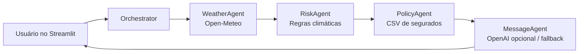

# InsurMinds Desafio 5 - Comunicação Climática Proativa

MVP acadêmico do Desafio 5 do curso InsurMinds/I2A2. A aplicação identifica riscos climáticos em uma cidade e produz comunicações preventivas para segurados potencialmente afetados.

**App publicado:** https://insurminds-desafio-5.streamlit.app

## Objetivo

Demonstrar uma arquitetura multiagente simples e explicável para apoiar a comunicação proativa de uma seguradora diante de eventos meteorológicos. O projeto combina dados reais da API pública Open-Meteo, regras de negócio e uma base fictícia de segurados.

## Arquitetura multiagente



### Agentes

- **WeatherAgent:** consulta latitude e longitude na Open-Meteo e retorna temperatura, precipitação, chuva, vento, `weather_code` e previsão horária das próximas 12 horas. Erros de rede retornam um resultado seguro, sem interromper o app.
- **RiskAgent:** classifica chuva intensa/alagamento, vento forte/vendaval e tempestade/granizo com regras determinísticas.
- **PolicyAgent:** lê `data/policyholders.csv`, filtra segurados da cidade do evento e cruza suas apólices Auto ou Residencial com as apólices afetadas.
- **MessageAgent:** gera mensagem preventiva personalizada por tipo de seguro e evento. Usa OpenAI apenas se `OPENAI_API_KEY` estiver configurada; caso contrário, utiliza fallback local.

## Tecnologias

Python, Streamlit, Requests, Pandas, python-dotenv, Open-Meteo API, OpenAI (opcional) e Pytest.

Não há LangChain: o fluxo foi mantido deliberadamente pequeno, direto e explicável para o contexto acadêmico.

## Instalação e execução

```bash
git clone https://github.com/maurojornalista/insurminds-desafio5.git
cd insurminds-desafio5
python -m venv .venv
```

Ative o ambiente virtual (`.venv\\Scripts\\Activate.ps1` no PowerShell Windows ou `source .venv/bin/activate` no Linux/macOS) e instale as dependências:

```bash
pip install -r requirements.txt
```

Execute a aplicação:

```bash
streamlit run app.py
```

Execute os testes:

```bash
pytest
```

## Chave OpenAI - opcional

Copie `.env.example` para `.env` e preencha `OPENAI_API_KEY` somente se desejar usar geração por IA:

```bash
OPENAI_API_KEY=sua_chave_aqui
OPENAI_MODEL=gpt-4o-mini
```

Sem chave, a aplicação permanece funcional e usa mensagens locais personalizadas. O arquivo `.env` é ignorado pelo Git e nenhuma chave deve ser incluída no repositório.

## Clima real e previsão

No modo **Clima real**, o WeatherAgent consulta a API Open-Meteo. A interface apresenta:

- temperatura atual;
- precipitação;
- chuva;
- velocidade do vento;
- código WMO;
- previsão de precipitação das próximas 12 horas;
- dados brutos resumidos da API.

## Modo demonstração

Além de **Clima real**, há cenários de:

- chuva intensa;
- vento forte;
- tempestade/granizo.

Eles tornam a demonstração repetível. Cada cenário apresenta uma **evolução simulada nas próximas 12 horas** e é identificado explicitamente como fictício.

> Dados simulados para fins acadêmicos e de demonstração.

## Testes

A validação final executou **7 testes automatizados**, todos aprovados.

A suíte cobre RiskAgent, PolicyAgent, MessageAgent, WeatherAgent e o fluxo do orquestrador.

## Limitações

- A base de segurados é fictícia e o cruzamento geográfico é feito por cidade.
- As regras de risco são didáticas e não substituem modelagem atuarial ou alertas oficiais.
- A previsão horária serve ao MVP acadêmico e não constitui serviço oficial de alerta.
- A geração por OpenAI é opcional e não é necessária para abrir ou testar o aplicativo.

## Links

- **Aplicação:** https://insurminds-desafio-5.streamlit.app
- **Relatório técnico:** `docs/relatorio_tecnico.md`

## Licença

Este projeto está licenciado sob a [MIT License](LICENSE).
