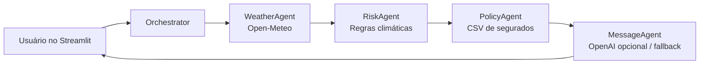

# InsurMinds Desafio 5 — Comunicação Climática Proativa

MVP acadêmico do Desafio 5 do curso InsurMinds/I2A2. A aplicação identifica riscos climáticos em uma cidade e produz comunicações preventivas para segurados potencialmente afetados.

## Objetivo

Demonstrar uma arquitetura multiagente simples e explicável para apoiar a comunicação proativa de uma seguradora diante de eventos meteorológicos. O projeto combina dados da API pública Open-Meteo, regras de negócio e uma base fictícia de apólices.

## Arquitetura multiagente



### Agentes

- **WeatherAgent:** consulta latitude e longitude na Open-Meteo e retorna temperatura, precipitação, chuva, vento e `weather_code`. Erros de rede retornam um resultado seguro, sem interromper o app.
- **RiskAgent:** classifica chuva intensa/alagamento, vento forte/vendaval e tempestade/granizo com regras determinísticas.
- **PolicyAgent:** lê `data/policyholders.csv`, filtra segurados da cidade do evento e cruza suas apólices Auto ou Residencial com as apólices afetadas.
- **MessageAgent:** gera uma mensagem preventiva personalizada. Usa OpenAI apenas se `OPENAI_API_KEY` estiver configurada; caso contrário (ou em caso de erro), utiliza um texto local.

## Tecnologias

Python, Streamlit, Requests, Pandas, python-dotenv, OpenAI (opcional) e Pytest. Não há LangChain: o fluxo é deliberadamente pequeno e direto para o contexto acadêmico.

## Instalação e execução

```bash
git clone https://github.com/maurojornalista/insurminds-desafio5.git
cd insurminds-desafio5
python -m venv .venv
```

Ative o ambiente virtual (`.venv\\Scripts\\Activate.ps1` no PowerShell Windows ou `source .venv/bin/activate` no Linux/macOS) e instale as dependências:

```bash
pip install -r requirements.txt
```

Execute a aplicação:

```bash
streamlit run app.py
```

Execute os testes:

```bash
pytest
```

## Chave OpenAI (opcional)

Copie `.env.example` para `.env` e preencha `OPENAI_API_KEY` somente se desejar usar a geração por IA:

```bash
OPENAI_API_KEY=sua_chave_aqui
OPENAI_MODEL=gpt-4o-mini
```

Sem chave, a aplicação permanece funcional e usa mensagens locais. O arquivo `.env` é ignorado pelo Git e nenhuma chave deve ser incluída no repositório.

## Modo demonstração

Além de **Clima real**, há cenários de **chuva intensa**, **vento forte** e **tempestade/granizo**. Eles evitam dependência de rede e tornam os comportamentos do MVP repetíveis.

> Cenário simulado para fins acadêmicos e de demonstração.

## Limitações

- A base de segurados é fictícia e o cruzamento geográfico é feito por cidade.
- As regras de risco são didáticas, não substituem modelagem atuarial, alertas oficiais ou análise de sinistro.
- A Open-Meteo fornece condições atuais, não um sistema de alertas meteorológicos completo.
- A geração por OpenAI é opcional e não é necessária para abrir ou testar o aplicativo.

## Licença

Este projeto está licenciado sob a [MIT License](LICENSE).
